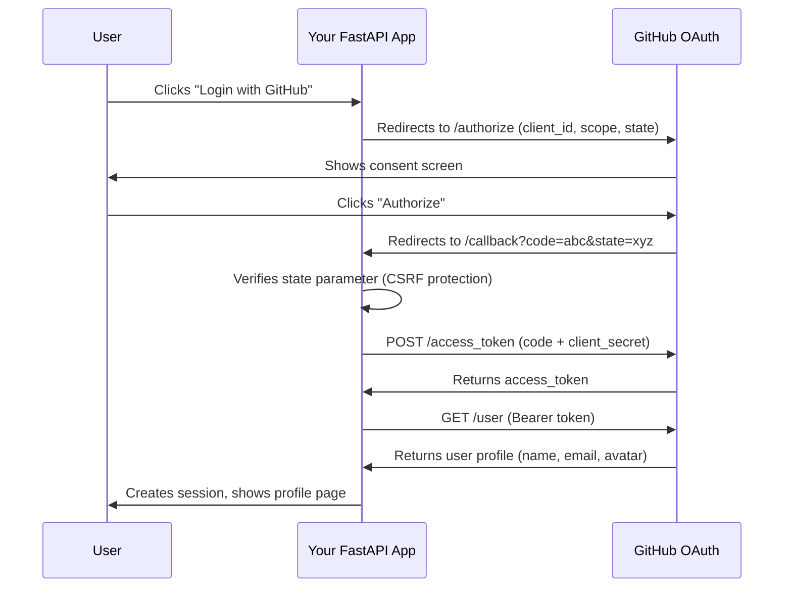

<p align="center">
  
</p>

<h3 align="center">Add "Login with GitHub" and "Login with Google" to any FastAPI app in one command.</h3>

<p align="center">
  <a href="https://pypi.org/project/oauth-for-dummies/"></a>
  <a href="https://www.python.org/"></a>
  <a href="https://fastapi.tiangolo.com/"></a>
  <a href="https://github.com/pranavkumaarofficial/oauth-for-dummies/stargazers"></a>
  <a href="LICENSE"></a>
</p>

<p align="center">
  <a href="#-quickstart">Quickstart</a>&nbsp;&nbsp;|&nbsp;&nbsp;<a href="#-how-oauth-20-works">How OAuth Works</a>&nbsp;&nbsp;|&nbsp;&nbsp;<a href="#-what-is-oauth-20">What is OAuth?</a>&nbsp;&nbsp;|&nbsp;&nbsp;<a href="#-cli-reference">CLI Reference</a>&nbsp;&nbsp;|&nbsp;&nbsp;<a href="#-tutorial">Tutorial</a>
</p>

---

## Why this exists

Adding OAuth to a FastAPI app should not take an afternoon. But it does, because:

- The official OAuth 2.0 spec is 76 pages long
- Every tutorial shows a different approach
- Redirect URI mismatches waste hours of debugging
- Production auth libraries are overkill when you just need "Login with GitHub"

**oauth-for-dummies** solves this. One CLI command drops working OAuth routes into your project. Two lines of code to integrate. Done.

---

## &#x26A1; Quickstart

```bash
pip install oauth-for-dummies
```

```bash
cd your-fastapi-project
oauth-init
```

That scaffolds three files into your project:

```
your-fastapi-project/
  oauth_config.py       # provider credentials from .env
  oauth_routes.py       # login, callback, logout endpoints
  oauth_example_app.py  # working demo app (optional)
  .env                  # template for your OAuth keys
```

Integrate into your existing FastAPI app with two lines:

```python
from oauth_routes import router as oauth_router

app.include_router(oauth_router)
```

Run the example to see it work:

```bash
pip install fastapi uvicorn httpx python-dotenv
# edit .env with your OAuth credentials
uvicorn oauth_example_app:app --reload
# open http://localhost:8000
```

---

## &#x1F914; What is OAuth 2.0?

OAuth 2.0 is how "Login with Google" works. Instead of giving an app your password, you tell Google: "let this app see my name and email." The app never touches your password. It gets a temporary **token** instead.

```
+----------+                              +--------------+
|   You    |   "Login with GitHub" ---->  |  Your App    |
| (User)   |                              |  (FastAPI)   |
+----------+                              +------+-------+
                                                 |
                           +---------------------+
                           v
                   +---------------+
                   |    GitHub     |   "Allow this app?"
                   |  OAuth Server |   <-- You click "Yes"
                   +-------+-------+
                           |
                           v  sends authorization code
                   +---------------+
                   |  Your App     |   exchanges code for token
                   |  (server)     |   uses token to get your profile
                   +-------+-------+
                           |
                           v
                   You're logged in. No password shared. Ever.
```

That's the entire OAuth 2.0 Authorization Code flow. This project implements it for you.

---

## &#x1F4CA; How OAuth 2.0 Works

Here's the step-by-step flow that happens when a user clicks "Login with GitHub":



**Key concepts:**

| Concept | What it means |
|---------|--------------|
| **Authorization Code** | A short-lived, one-time code the provider sends to your app. Not the token itself. |
| **Access Token** | The actual key your app uses to call the provider's API. Obtained by exchanging the code. |
| **State Parameter** | A random string your app generates to prevent CSRF attacks. Verified on callback. |
| **Scopes** | Permissions you request. `read:user` = profile info, `user:email` = email address. |
| **Redirect URI** | The URL the provider sends the user back to. Must match exactly what you registered. |

---

## &#x1F527; Getting OAuth Credentials

### GitHub OAuth Setup

1. Go to **[github.com/settings/developers](https://github.com/settings/developers)**
2. Click **"New OAuth App"**
3. Set these values:
   - **Application name:** anything (e.g. `My App`)
   - **Homepage URL:** `http://localhost:8000`
   - **Authorization callback URL:** `http://localhost:8000/auth/github/callback`
4. Copy **Client ID** and **Client Secret** into your `.env` file

### Google OAuth Setup

1. Go to **[console.cloud.google.com/apis/credentials](https://console.cloud.google.com/apis/credentials)**
2. Click **"Create Credentials"** > **"OAuth Client ID"**
3. Application type: **Web application**
4. Add authorized redirect URI: `http://localhost:8000/auth/google/callback`
5. Copy **Client ID** and **Client Secret** into your `.env` file

---

## &#x1F4CB; API Reference

### Routes

After running `oauth-init`, your app gets these endpoints:

| Endpoint | Method | Description |
|----------|--------|-------------|
| `/auth/github/login` | GET | Redirects user to GitHub's OAuth consent screen |
| `/auth/github/callback` | GET | Handles GitHub's redirect, exchanges code for token |
| `/auth/google/login` | GET | Redirects user to Google's OAuth consent screen |
| `/auth/google/callback` | GET | Handles Google's redirect, exchanges code for token |
| `/auth/logout` | GET | Clears session cookie, redirects to home |

### Session Helper

```python
from oauth_routes import get_session

@app.get("/dashboard")
async def dashboard(request: Request):
    user = get_session(request)
    if not user:
        return RedirectResponse("/auth/github/login")

    # user dict contains:
    # - id: str        (provider's user ID)
    # - name: str      (display name)
    # - email: str     (email address, may be None)
    # - avatar: str    (profile picture URL)
    # - provider: str  ("github" or "google")

    return {"welcome": user["name"]}
```

---

## &#x1F4BB; CLI Reference

```bash
oauth-init                         # scaffold all providers + example app
oauth-init --provider github       # only GitHub OAuth
oauth-init --provider google       # only Google OAuth
oauth-init --no-example            # skip the example app, just routes + config
oauth-init --dir ./path/to/project # scaffold into a specific directory
```

**Generated files:**

| File | Purpose | Lines |
|------|---------|-------|
| `oauth_config.py` | Loads provider credentials from `.env`, configures OAuth endpoints | ~45 |
| `oauth_routes.py` | FastAPI router with login, callback, logout, session management | ~150 |
| `oauth_example_app.py` | Complete working demo with login page and profile page | ~85 |
| `.env` | Template with all required environment variables | ~12 |

---

## &#x1F6E1;&#xFE0F; Security

The generated code includes these security measures out of the box:

- **CSRF protection** via the `state` parameter (random token verified on callback)
- **HTTP-only cookies** for session IDs (not accessible via JavaScript)
- **SameSite=Lax** cookie policy (prevents cross-site request forgery)
- **Server-side token exchange** (client secret never exposed to the browser)
- **One-hour session expiry** (configurable via `max_age`)

> **Note:** The generated code uses in-memory session storage. For production, swap `_sessions` dict for Redis, PostgreSQL, or your database of choice.

---

## &#x1F504; Comparison with Other Libraries

| | **oauth-for-dummies** | **Authlib** | **OAuthLib** | **python-social-auth** |
|---|---|---|---|---|
| **Use case** | Add OAuth fast | Production auth | Spec compliance | Full social auth |
| **Setup time** | 30 seconds | 30+ minutes | 1+ hours | 30+ minutes |
| **Lines to integrate** | 2 | 15+ | 30+ | 20+ |
| **Working demo included** | Yes | No | No | No |
| **Beginner-friendly** | Yes | No | No | Moderate |
| **CLI scaffolding** | Yes | No | No | No |
| **Dependencies** | FastAPI + httpx | Many | Many | Many |

**This is not a replacement for Authlib.** Use oauth-for-dummies to get started fast, learn how OAuth works, and prototype. Use Authlib when you need production-grade token management, PKCE, or OpenID Connect compliance.

---

## &#x1F4D6; Tutorial

This repo includes a complete tutorial app that logs every step of the OAuth flow to your terminal:

```bash
git clone https://github.com/pranavkumaarofficial/oauth-for-dummies.git
cd oauth-for-dummies
pip install -r requirements.txt
cp .env.example .env
# add your OAuth credentials to .env
uvicorn app.main:app --reload
```

You'll see output like this for every login:

```
============================================================
  STEP 1 — Redirect user to GitHub
============================================================
  URL: https://github.com/login/oauth/authorize
  client_id:    abc12345...
  redirect_uri: http://localhost:8000/auth/github/callback
  scope:        read:user user:email
  state:        kF9x2mQp...
============================================================
```

See also:
- **[How OAuth Works](docs/how-oauth-works.md)** — visual explanation of every step
- **[Step-by-step Tutorial](docs/tutorial.md)** — build OAuth from scratch

---

## &#x1F5C2;&#xFE0F; Project Structure

```
oauth-for-dummies/
|-- oauth_for_dummies/           # pip-installable CLI package
|   |-- cli.py                   # oauth-init command
|   +-- scaffold/                # template files dropped into your project
|       |-- oauth_config.py
|       |-- oauth_routes.py
|       +-- oauth_example_app.py
|
|-- app/                         # tutorial app (learning resource)
|   |-- main.py                  # FastAPI demo with UI
|   |-- config.py                # environment variable loader
|   +-- auth/
|       |-- routes.py            # auth route handlers
|       +-- storage.py           # session storage
|
|-- providers/                   # OAuth provider implementations
|   |-- base.py                  # abstract OAuthProvider class
|   |-- github.py                # GitHub OAuth provider
|   |-- google.py                # Google OAuth provider
|   +-- registry.py              # provider auto-discovery
|
|-- tests/                       # unit tests (20 tests, all passing)
|-- docs/                        # tutorials and diagrams
+-- pyproject.toml               # PyPI packaging configuration
```

---

## &#x1F91D; Contributing

Contributions welcome. Some ideas:

- **Add a provider** — Discord, Spotify, Twitter/X, LinkedIn, Apple
- **Improve the CLI** — interactive mode, `--framework flask` support
- **Write tests** for the scaffold files

See **[CONTRIBUTING.md](CONTRIBUTING.md)** for setup instructions.

---

## &#x2753; FAQ

**Q: Is this production-ready?**
A: The generated code is fine for internal tools, prototypes, and small apps. For production at scale, swap the in-memory session store for a database and add HTTPS.

**Q: Can I use this with Flask/Django?**
A: Not yet. Currently FastAPI only. Flask support is planned.

**Q: What Python versions are supported?**
A: Python 3.9 and above.

**Q: Do I need to understand OAuth to use this?**
A: No. Run `oauth-init`, add your keys to `.env`, and it works. But if you want to understand what's happening, read the [tutorial](docs/tutorial.md).

---

## &#x1F4C4; License

MIT — use it, learn from it, build on it.

---

<p align="center">
  <sub>If this saved you time, consider giving it a <a href="https://github.com/pranavkumaarofficial/oauth-for-dummies">star on GitHub</a>.</sub>
</p>
