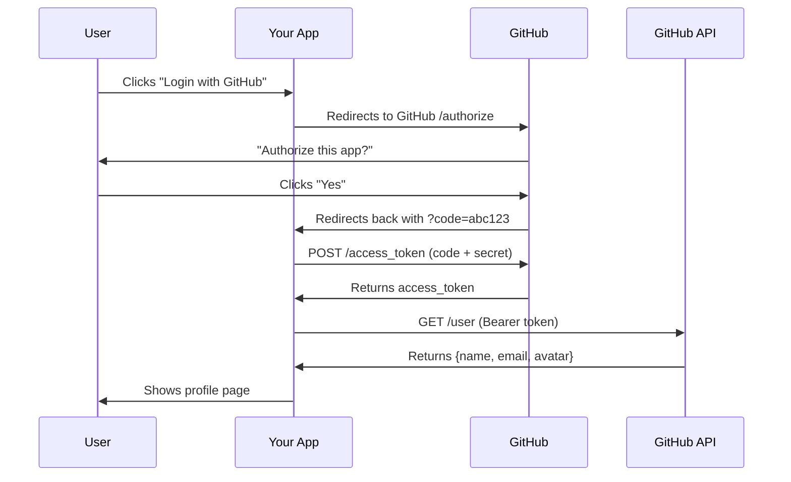

<p align="center">
  
</p>

<p align="center">
  <strong>Learn OAuth 2.0 the easy way. Build it. Break it. Get it.</strong>
</p>

<p align="center">
  <a href="#-quickstart"></a>
  <a href="https://github.com/pranavkumaarofficial/oauth-for-dummies/stargazers"></a>
  <a href="LICENSE"></a>
  <a href="https://www.python.org/"></a>
  <a href="https://fastapi.tiangolo.com/"></a>
</p>

<p align="center">
  <a href="#-what-is-oauth-20">What is OAuth?</a> ·
  <a href="#-quickstart">Quickstart</a> ·
  <a href="#-providers">Providers</a> ·
  <a href="#-project-structure">Structure</a> ·
  <a href="#-add-your-own-provider">Extend</a>
</p>

---

## What is OAuth 2.0?

You know how some apps say "Login with Google"? That's OAuth.

Instead of giving an app your password, you tell Google: *"Let this app see my name and email."* The app never sees your password. It gets a **token** instead.

```
┌──────────┐                          ┌──────────────┐
│   You    │  "Login with GitHub"     │  Your App    │
│  (User)  │ ──────────────────────►  │  (FastAPI)   │
└──────────┘                          └──────┬───────┘
                                             │
                      ┌──────────────────────┘
                      ▼
              ┌───────────────┐
              │    GitHub     │  "Allow this app?"
              │  OAuth Server │ ◄── You click "Yes"
              └───────┬───────┘
                      │
                      ▼  sends auth code
              ┌───────────────┐
              │  Your App     │  exchanges code → gets token
              │  calls GitHub │  uses token → gets your profile
              │  API          │
              └───────────────┘
                      │
                      ▼
              You're logged in. No password shared. Ever.
```

That's it. That's OAuth. This project shows you how to build this from scratch with real code.

---

## Quickstart

> You need GitHub OAuth keys first. If you don't have them, jump to [Setup Your OAuth App](#-setup-your-oauth-app) and come back.

```bash
git clone https://github.com/pranavkumaarofficial/oauth-for-dummies.git
cd oauth-for-dummies

pip install -r requirements.txt

cp .env.example .env
# Edit .env - add your GITHUB_CLIENT_ID and GITHUB_CLIENT_SECRET

uvicorn app.main:app --reload
# Open http://localhost:8000 and click "Login with GitHub"
```

---

## Why this over Authlib/OAuthLib?

| | **OAuth for Dummies** | **Authlib** | **OAuthLib** | **requests-oauthlib** |
|---|---|---|---|---|
| **Goal** | Learn OAuth | Production auth | Spec compliance | HTTP client auth |
| **Beginner friendly?** | Yes | No | No | Somewhat |
| **Working demo app?** | Yes, full UI | No | No | No |
| **Step-by-step tutorial?** | Yes | Reference only | Reference only | Reference only |
| **Visual flow diagrams?** | Yes | No | No | No |
| **Lines to "hello world"** | ~20 | ~50 | ~80+ | ~40 |

This is not a replacement for Authlib. Use this *before* Authlib so you actually understand what's going on under the hood.

---

## Providers

| Provider | Status | What You'll Learn |
|----------|--------|-------------------|
| GitHub | Ready | The core OAuth 2.0 flow |
| Google | Ready | OpenID Connect basics |
| Discord | Template | Scopes and permissions |
| Spotify | Template | Refresh tokens |
| Custom | Template | Build your own |

Want to add one? See [Add Your Own Provider](#-add-your-own-provider).

---

## Project Structure

```
oauth-for-dummies/
│
├── app/
│   ├── main.py              # FastAPI app entry point, start here
│   ├── config.py            # Settings from .env
│   ├── auth/
│   │   ├── routes.py        # /auth/login, /auth/callback, /auth/logout
│   │   └── storage.py       # In-memory session store
│   ├── templates/
│   │   ├── index.html       # Landing page with login buttons
│   │   ├── profile.html     # Shows user data after login
│   │   └── error.html       # Error page
│   └── static/
│       └── style.css        # Dark mode styles
│
├── providers/
│   ├── base.py              # OAuthProvider base class
│   ├── github.py            # GitHub provider
│   ├── google.py            # Google provider
│   └── registry.py          # Provider registry
│
├── docs/
│   ├── tutorial.md          # Step-by-step beginner guide
│   ├── how-oauth-works.md   # Visual explanation
│   └── diagrams/
│       ├── logo.svg         # Project logo
│       └── flow.mmd         # Mermaid diagram source
│
├── tests/
│   ├── test_providers.py    # Provider unit tests
│   └── test_auth_flow.py    # Auth flow tests
│
├── .env.example             # Copy to .env, add your keys
├── requirements.txt
├── Dockerfile
├── LICENSE
└── README.md
```

---

## Setup Your OAuth App

### GitHub

1. Go to [github.com/settings/developers](https://github.com/settings/developers)
2. Click **"New OAuth App"**
3. Fill in:
   - **Application name:** `OAuth for Dummies (dev)`
   - **Homepage URL:** `http://localhost:8000`
   - **Callback URL:** `http://localhost:8000/auth/github/callback`
4. Copy your **Client ID** and **Client Secret** into `.env`

### Google

1. Go to [console.cloud.google.com/apis/credentials](https://console.cloud.google.com/apis/credentials)
2. Create a new **OAuth 2.0 Client ID**
3. Add authorized redirect URI: `http://localhost:8000/auth/google/callback`
4. Copy credentials into `.env`

---

## Add Your Own Provider

Every provider is a single Python file:

```python
# providers/discord.py
from providers.base import OAuthProvider

class DiscordProvider(OAuthProvider):
    name = "discord"
    display_name = "Discord"
    authorize_url = "https://discord.com/api/oauth2/authorize"
    token_url = "https://discord.com/api/oauth2/token"
    userinfo_url = "https://discord.com/api/users/@me"
    default_scopes = ["identify", "email"]

    def normalize_userinfo(self, raw: dict) -> dict:
        return {
            "id": raw["id"],
            "name": raw["username"],
            "email": raw.get("email"),
            "avatar": f"https://cdn.discordapp.com/avatars/{raw['id']}/{raw['avatar']}.png",
        }
```

Drop it in `providers/`, register it in `registry.py`, add your keys to `.env`, restart. Done.

---

## The OAuth Flow (Step by Step)



Every step is logged in your terminal so you can see exactly what's happening.

---

## Docker

```bash
docker build -t oauth-for-dummies .
docker run -p 8000:8000 --env-file .env oauth-for-dummies
```

---

## Contributing

First contributions that would help:
- Add a new OAuth provider (Discord, Spotify, Twitter, etc.)
- Improve the tutorial
- Add tests
- Translate the docs

See [CONTRIBUTING.md](CONTRIBUTING.md) for details.

Questions? Reach out at kumaarp.in@gmail.com

---

## License

MIT

---

<p align="center">
  <sub>Built by <a href="https://github.com/pranavkumaarofficial">Pranav K</a></sub>
</p>
