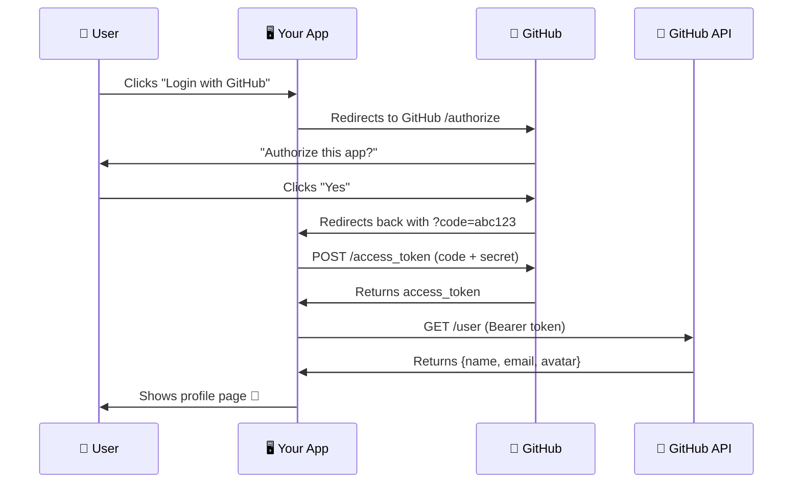

<p align="center">
  
</p>

<p align="center">
  <strong>🔐 Learn OAuth 2.0 the easy way. Build it. Break it. Get it.</strong>
</p>

<p align="center">
  <a href="#-60-second-quickstart"></a>
  <a href="https://github.com/yourusername/oauth-for-dummies/stargazers"></a>
  <a href="LICENSE"></a>
  <a href="https://www.python.org/"></a>
  <a href="https://fastapi.tiangolo.com/"></a>
</p>

<p align="center">
  <a href="#-what-is-oauth-20">What is OAuth?</a> •
  <a href="#-60-second-quickstart">Quickstart</a> •
  <a href="#-supported-providers">Providers</a> •
  <a href="#-project-structure">Structure</a> •
  <a href="#-add-your-own-provider">Extend</a> •
  <a href="#-why-this-exists">Why?</a>
</p>

---

## 🤷 What is OAuth 2.0?

**You know how some apps say "Login with Google"?** That's OAuth.

Instead of giving an app your password, you tell Google: *"Hey, it's cool — let this app see my name and email."* The app never sees your password. It gets a **token** instead.

```
┌──────────┐                          ┌──────────────┐
│   You    │  "Login with GitHub"     │  Your App    │
│  (User)  │ ──────────────────────►  │  (FastAPI)   │
└──────────┘                          └──────┬───────┘
                                             │
                      ┌──────────────────────┘
                      ▼
              ┌───────────────┐
              │    GitHub     │  "Allow this app?"
              │  OAuth Server │ ◄── You click "Yes"
              └───────┬───────┘
                      │
                      ▼  sends auth code
              ┌───────────────┐
              │  Your App     │  exchanges code → gets token
              │  calls GitHub │  uses token → gets your profile
              │  API          │
              └───────────────┘
                      │
                      ▼
              🎉 You're logged in. No password shared. Ever.
```

**That's it. That's OAuth.** This project shows you exactly how to build this, step by step, with real code.

---

## ⏱️ 60-Second Quickstart

```bash
# 1. Clone it
git clone https://github.com/yourusername/oauth-for-dummies.git
cd oauth-for-dummies

# 2. Install it
pip install -r requirements.txt

# 3. Copy the example env and add your GitHub OAuth keys
cp .env.example .env
# Edit .env with your CLIENT_ID and CLIENT_SECRET

# 4. Run it
uvicorn app.main:app --reload

# 5. Open http://localhost:8000 and click "Login with GitHub" 🎉
```

> **Don't have GitHub OAuth keys yet?** See [Setup Guide →](#-setup-your-oauth-app)

---

## 🆚 Why This Exists

| | **OAuth for Dummies** | **Authlib** | **OAuthLib** | **requests-oauthlib** |
|---|---|---|---|---|
| **Goal** | Learn OAuth | Production auth | Spec compliance | HTTP client auth |
| **Beginner friendly?** | ✅ Extremely | ❌ Advanced | ❌ Advanced | ⚠️ Moderate |
| **Working demo app?** | ✅ Full UI | ❌ No | ❌ No | ❌ No |
| **Step-by-step docs?** | ✅ Tutorial-style | ⚠️ Reference only | ⚠️ Reference only | ⚠️ Reference only |
| **Visual flow diagrams?** | ✅ Yes | ❌ No | ❌ No | ❌ No |
| **Add providers easily?** | ✅ Plugin pattern | ✅ Yes | ⚠️ Complex | ⚠️ Moderate |
| **Lines of code to "hello world"** | ~20 | ~50 | ~80+ | ~40 |

**This isn't a replacement for Authlib.** It's the thing you use *before* Authlib so you actually understand what's happening.

---

## 🌐 Supported Providers

| Provider | Status | Difficulty | What You'll Learn |
|----------|--------|-----------|-------------------|
| 🐙 **GitHub** | ✅ Ready | Beginner | The core OAuth 2.0 flow |
| 🔵 **Google** | ✅ Ready | Beginner | OpenID Connect basics |
| 🟣 **Discord** | 📋 Template | Intermediate | Scopes & permissions |
| 🟢 **Spotify** | 📋 Template | Intermediate | Refresh tokens |
| 🔧 **Custom** | 📋 Template | Advanced | Build your own provider |

> **Want to add a provider?** See [Add Your Own Provider →](#-add-your-own-provider)

---

## 🏗️ Project Structure

```
oauth-for-dummies/
│
├── app/
│   ├── main.py                 # FastAPI app — start here
│   ├── config.py               # Settings from .env
│   │
│   ├── auth/
│   │   ├── routes.py           # /auth/login, /auth/callback
│   │   ├── utils.py            # Token exchange helpers
│   │   └── storage.py          # Simple token store (JSON file)
│   │
│   ├── templates/
│   │   ├── index.html          # Landing page with login buttons
│   │   ├── profile.html        # Show user data after login
│   │   └── error.html          # Friendly error page
│   │
│   └── static/
│       └── style.css           # Minimal, clean styles
│
├── providers/
│   ├── base.py                 # OAuthProvider base class
│   ├── github.py               # GitHub provider
│   ├── google.py               # Google provider
│   └── registry.py             # Auto-discover providers
│
├── docs/
│   ├── tutorial.md             # Step-by-step beginner guide
│   ├── how-oauth-works.md      # Visual explanation
│   └── diagrams/
│       ├── logo.svg            # Project logo
│       └── flow.mmd            # Mermaid source for diagrams
│
├── tests/
│   ├── test_providers.py       # Provider unit tests
│   └── test_auth_flow.py       # Integration tests
│
├── .env.example                # Copy this → .env
├── requirements.txt            # Dependencies
├── Dockerfile                  # One-command containerized demo
├── LICENSE                     # MIT
└── README.md                   # You are here
```

---

## 🔧 Setup Your OAuth App

### GitHub

1. Go to [github.com/settings/developers](https://github.com/settings/developers)
2. Click **"New OAuth App"**
3. Fill in:
   - **Application name:** `OAuth for Dummies (dev)`
   - **Homepage URL:** `http://localhost:8000`
   - **Callback URL:** `http://localhost:8000/auth/github/callback`
4. Copy your **Client ID** and **Client Secret** into `.env`

### Google

1. Go to [console.cloud.google.com/apis/credentials](https://console.cloud.google.com/apis/credentials)
2. Create a new **OAuth 2.0 Client ID**
3. Add authorized redirect URI: `http://localhost:8000/auth/google/callback`
4. Copy credentials into `.env`

---

## 🔌 Add Your Own Provider

Every provider is a single Python file. Here's the pattern:

```python
# providers/my_provider.py
from providers.base import OAuthProvider

class MyProvider(OAuthProvider):
    name = "my_provider"
    display_name = "My Service"
    authorize_url = "https://my-service.com/oauth/authorize"
    token_url = "https://my-service.com/oauth/token"
    userinfo_url = "https://my-service.com/api/me"
    default_scopes = ["read:user"]

    def normalize_userinfo(self, raw: dict) -> dict:
        """Map provider-specific fields to a common shape."""
        return {
            "id": raw["id"],
            "name": raw["display_name"],
            "email": raw.get("email"),
            "avatar": raw.get("avatar_url"),
        }
```

Drop it in `providers/`, add your keys to `.env`, restart. Done.

---

## 📚 How the OAuth Flow Works (Step by Step)



> Every step is logged in your terminal with clear labels so you can see exactly what's happening.

---

## 🐳 Docker (Zero Setup)

```bash
docker build -t oauth-for-dummies .
docker run -p 8000:8000 --env-file .env oauth-for-dummies
```

---

## 🤝 Contributing

This project is built for beginners, by beginners (and some experienced devs who remember being confused).

**Great first contributions:**
- 🌐 Add a new OAuth provider (Discord, Spotify, Twitter, etc.)
- 📝 Improve the tutorial docs
- 🎨 Make the demo UI prettier
- 🧪 Add tests
- 🌍 Translate the tutorial

See [CONTRIBUTING.md](CONTRIBUTING.md) for details.

---

## ⭐ Star History

If this helped you understand OAuth, **smash that star button.** It helps others find this project.

[](https://star-history.com/#yourusername/oauth-for-dummies&Date)

---

## 📄 License

MIT — use it, learn from it, build on it.

---

<p align="center">
  <strong>Built with ❤️ for everyone who's ever been confused by OAuth.</strong><br/>
  <sub>If this project helped you, consider sharing it on <a href="https://twitter.com/intent/tweet?text=Finally%20understood%20OAuth%202.0%20thanks%20to%20this%20project%20🔐&url=https://github.com/yourusername/oauth-for-dummies">Twitter</a> or <a href="https://www.reddit.com/submit?url=https://github.com/yourusername/oauth-for-dummies&title=OAuth%20for%20Dummies%20-%20Finally%20understand%20OAuth%202.0">Reddit</a>.</sub>
</p>
