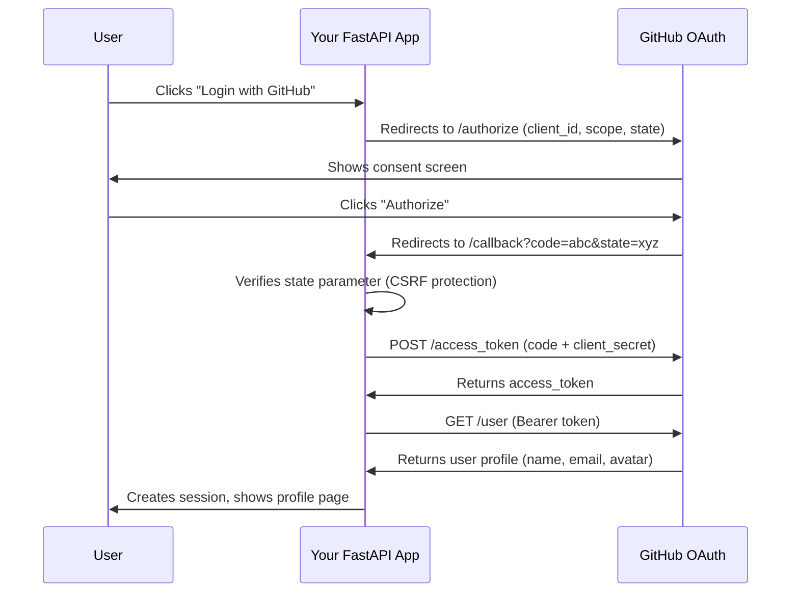

# OAuth for Dummies

### Add OAuth login to any FastAPI app in one command. 6 providers. PKCE support. Built-in OAuth debugger.

<p>
  <a href="https://pypi.org/project/oauth-for-dummies/"></a>
  <a href="https://www.python.org/"></a>
  <a href="https://fastapi.tiangolo.com/"></a>
  <a href="https://github.com/pranavkumaarofficial/oauth-for-dummies/stargazers"></a>
  <a href="LICENSE"></a>
</p>

```bash
pip install oauth-for-dummies
cd your-fastapi-project
oauth-init
```

Two lines to integrate into your existing app:

```python
from oauth_routes import router as oauth_router

app.include_router(oauth_router)
```

Done. You now have `/auth/{provider}/login`, `/auth/{provider}/callback`, and `/auth/logout`.

<p align="center">
  
</p>

---

[Providers](#supported-providers) | [OAuth Debugger](#oauth-debugger) | [PKCE / OAuth 2.1](#pkce--oauth-21) | [How it compares](#comparison) | [How OAuth works](#what-is-oauth-20) | [CLI Reference](#cli-reference)

---

## Why this exists

Adding OAuth to a FastAPI app should not take an afternoon. But it does, because:

- The official OAuth 2.0 spec is 76 pages long
- Every tutorial shows a different approach
- Redirect URI mismatches waste hours of debugging
- Production auth libraries are overkill when you just need "Login with GitHub"

oauth-for-dummies solves this. One CLI command drops working OAuth routes into your project. You own the code, there's no runtime dependency, and you can read every line.

---

## Comparison

| | oauth-for-dummies | fastapi-oauth2 | Authlib | python-social-auth |
|---|---|---|---|---|
| What it is | CLI scaffold + debugger | Middleware library | Production auth library | Social auth framework |
| Approach | You own the code | Black box middleware | Black box library | Black box framework |
| Setup time | 30 seconds | 5 minutes | 30+ minutes | 30+ minutes |
| Providers | 6 | Many | Many | Many |
| OAuth debugger | Yes | No | No | No |
| PKCE / OAuth 2.1 | Yes | No | Yes | No |
| CLI scaffolding | Yes | No | No | No |

Use oauth-for-dummies when you want to understand OAuth, get started fast, and own the code.

Use something else when you need 20+ providers, enterprise SSO (SAML), or a maintained library you don't want to touch.

---

## Supported providers

| Provider | Scopes |
|----------|--------|
| GitHub | `read:user`, `user:email` |
| Google | `openid`, `email`, `profile` |
| Discord | `identify`, `email` |
| Spotify | `user-read-email`, `user-read-private` |
| Microsoft | `openid`, `email`, `profile`, `User.Read` |
| LinkedIn | `openid`, `profile`, `email` |

Only configure the providers you need. Unconfigured ones don't appear in the UI.

---

## Quickstart

```bash
pip install oauth-for-dummies
```

```bash
cd your-fastapi-project
oauth-init
```

This scaffolds four files:

```
your-fastapi-project/
  oauth_config.py       # provider credentials from .env (6 providers)
  oauth_routes.py       # login, callback, logout + PKCE support
  oauth_example_app.py  # working demo app (optional)
  .env                  # template for your OAuth keys
```

Run the example to see it work:

```bash
pip install fastapi uvicorn httpx python-dotenv
# edit .env with your OAuth credentials
uvicorn oauth_example_app:app --reload
# open http://localhost:8000
```

---

## OAuth debugger

The tutorial app includes a built-in OAuth debugger (Learn Mode) that captures and displays every HTTP request and response in the OAuth flow, in real time, with real data.

Click "Learn Mode" next to any provider to see:

1. Authorization request -- the exact URL your app constructs, with every query parameter explained
2. Callback -- the authorization code and state token received from the provider, with CSRF verification
3. Token exchange -- the server-to-server POST request body and the token response
4. User info -- the raw API response from the provider's userinfo endpoint
5. Normalized profile -- how your app maps provider-specific fields into a standard shape

Each step has expandable explanations of what happened and why. You see exactly what your code is doing.

```bash
git clone https://github.com/pranavkumaarofficial/oauth-for-dummies.git
cd oauth-for-dummies
pip install -e .
cp .env.example .env
# add at least one provider's credentials to .env
uvicorn app.main:app --reload
# open http://localhost:8000 and click "Learn Mode"
```

---

## PKCE / OAuth 2.1

The project supports PKCE (Proof Key for Code Exchange), the main security improvement in OAuth 2.1. PKCE replaces the client secret with a cryptographic challenge, making OAuth safe for public clients (mobile apps, SPAs).

### How it works

Instead of sending `client_secret` during token exchange, PKCE:
1. Generates a random `code_verifier` (86 chars)
2. Hashes it into a `code_challenge` (SHA-256, base64url)
3. Sends the challenge with the authorization request
4. Sends the verifier with the token exchange
5. The provider verifies `SHA256(verifier) == challenge`

### Enable PKCE on any provider

In the tutorial app, add one line to any provider class:

```python
class MyProvider(OAuthProvider):
    use_pkce = True  # that's it
```

In the scaffold, add the provider key to the `PKCE_PROVIDERS` set in `oauth_routes.py`:

```python
PKCE_PROVIDERS = {"my_provider"}
```

The Learn Mode debugger shows PKCE parameters (code_challenge, code_verifier) when enabled.

---

## What is OAuth 2.0?

OAuth 2.0 is how "Login with Google" works. Instead of giving an app your password, you tell Google: "let this app see my name and email." The app never touches your password. It gets a temporary token instead.

```
+----------+                              +--------------+
|   You    |   "Login with GitHub" ---->  |  Your App    |
| (User)   |                              |  (FastAPI)   |
+----------+                              +------+-------+
                                                 |
                           +---------------------+
                           v
                   +---------------+
                   |    GitHub     |   "Allow this app?"
                   |  OAuth Server |   <-- You click "Yes"
                   +-------+-------+
                           |
                           v  sends authorization code
                   +---------------+
                   |  Your App     |   exchanges code for token
                   |  (server)     |   uses token to get your profile
                   +-------+-------+
                           |
                           v
                   You're logged in. No password shared. Ever.
```

### Step-by-step flow



### Key concepts

| Concept | What it means |
|---------|--------------|
| Authorization Code | A short-lived, one-time code the provider sends to your app. Not the token itself. |
| Access Token | The actual key your app uses to call the provider's API. Obtained by exchanging the code. |
| State Parameter | A random string your app generates to prevent CSRF attacks. Verified on callback. |
| Scopes | Permissions you request. `read:user` = profile info, `user:email` = email address. |
| Redirect URI | The URL the provider sends the user back to. Must match exactly what you registered. |
| PKCE | Proof Key for Code Exchange. Replaces client_secret with a cryptographic challenge. Required in OAuth 2.1. |

---

## Getting OAuth credentials

### GitHub

1. Go to [github.com/settings/developers](https://github.com/settings/developers)
2. Click "New OAuth App"
3. Set callback URL to `http://localhost:8000/auth/github/callback`
4. Copy Client ID and Client Secret into `.env`

### Google

1. Go to [console.cloud.google.com/apis/credentials](https://console.cloud.google.com/apis/credentials)
2. Click "Create Credentials" > "OAuth Client ID" > Web application
3. Add redirect URI: `http://localhost:8000/auth/google/callback`
4. Copy Client ID and Client Secret into `.env`

### Discord

1. Go to [discord.com/developers/applications](https://discord.com/developers/applications)
2. Create a new application > OAuth2
3. Add redirect: `http://localhost:8000/auth/discord/callback`
4. Copy Client ID and Client Secret into `.env`

### Spotify

1. Go to [developer.spotify.com/dashboard](https://developer.spotify.com/dashboard)
2. Create an app > Edit Settings
3. Add redirect URI: `http://localhost:8000/auth/spotify/callback`
4. Copy Client ID and Client Secret into `.env`

### Microsoft

1. Go to [portal.azure.com](https://portal.azure.com/#blade/Microsoft_AAD_RegisteredApps)
2. Register a new application > Web platform
3. Add redirect URI: `http://localhost:8000/auth/microsoft/callback`
4. Copy Application (client) ID and create a Client Secret in `.env`

### LinkedIn

1. Go to [linkedin.com/developers/apps](https://www.linkedin.com/developers/apps)
2. Create a new app > Auth tab
3. Add redirect URL: `http://localhost:8000/auth/linkedin/callback`
4. Copy Client ID and Client Secret into `.env`

---

## API reference

### Routes

After running `oauth-init`, your app gets these endpoints for each configured provider:

| Endpoint | Method | Description |
|----------|--------|-------------|
| `/auth/{provider}/login` | GET | Redirects user to the provider's OAuth consent screen |
| `/auth/{provider}/callback` | GET | Handles the redirect, exchanges code for token |
| `/auth/logout` | GET | Clears session cookie, redirects to home |

Where `{provider}` is one of: `github`, `google`, `discord`, `spotify`, `microsoft`, `linkedin`.

### Session helper

```python
from oauth_routes import get_session

@app.get("/dashboard")
async def dashboard(request: Request):
    user = get_session(request)
    if not user:
        return RedirectResponse("/auth/github/login")

    # user dict contains:
    # - id: str        (provider's user ID)
    # - name: str      (display name)
    # - email: str     (email address, may be None)
    # - avatar: str    (profile picture URL)
    # - provider: str  ("github", "google", "discord", etc.)

    return {"welcome": user["name"]}
```

---

## CLI reference

```bash
oauth-init                          # scaffold all providers + example app
oauth-init --provider github        # only GitHub OAuth
oauth-init --provider discord       # only Discord OAuth
oauth-init --no-example             # skip the example app, just routes + config
oauth-init --dir ./path/to/project  # scaffold into a specific directory
```

Available `--provider` values: `github`, `google`, `discord`, `spotify`, `microsoft`, `linkedin`.

Generated files:

| File | Purpose |
|------|---------|
| `oauth_config.py` | Loads provider credentials from `.env`, configures OAuth endpoints for all 6 providers |
| `oauth_routes.py` | FastAPI router with login, callback, logout, session management, and PKCE support |
| `oauth_example_app.py` | Complete working demo with login page and profile page |
| `.env` | Template with environment variables for all providers |

---

## Security

The generated code includes these security measures:

- CSRF protection via the `state` parameter (random token verified on callback)
- PKCE support for OAuth 2.1 compliance (S256 code challenge)
- HTTP-only cookies for session IDs (not accessible via JavaScript)
- SameSite=Lax cookie policy (prevents cross-site request forgery)
- Server-side token exchange (client secret never exposed to the browser)
- One-hour session expiry (configurable via `max_age`)

The generated code uses in-memory session storage. For production, swap the `_sessions` dict for Redis, PostgreSQL, or your database of choice.

---

## Project structure

```
oauth-for-dummies/
|-- oauth_for_dummies/           # pip-installable CLI package
|   |-- cli.py                   # oauth-init command
|   +-- scaffold/                # template files dropped into your project
|       |-- oauth_config.py      # 6 provider configs
|       |-- oauth_routes.py      # routes + PKCE support
|       +-- oauth_example_app.py # demo with branded buttons
|
|-- app/                         # tutorial app (learning resource)
|   |-- main.py                  # FastAPI demo with UI
|   |-- config.py                # environment variable loader
|   |-- auth/
|   |   |-- routes.py            # auth route handlers
|   |   +-- storage.py           # session + debug session storage
|   +-- learn/
|       +-- routes.py            # OAuth debugger (Learn Mode) routes
|
|-- providers/                   # OAuth provider implementations
|   |-- base.py                  # abstract OAuthProvider class + PKCE
|   |-- github.py                # GitHub
|   |-- google.py                # Google
|   |-- discord.py               # Discord
|   |-- spotify.py               # Spotify
|   |-- microsoft.py             # Microsoft
|   |-- linkedin.py              # LinkedIn
|   +-- registry.py              # provider auto-discovery
|
|-- tests/                       # unit tests (20 tests, all passing)
|-- docs/                        # tutorials and diagrams
+-- pyproject.toml               # PyPI packaging configuration
```

---

## Tutorial

This repo includes a complete tutorial app that logs every step of the OAuth flow to your terminal:

```bash
git clone https://github.com/pranavkumaarofficial/oauth-for-dummies.git
cd oauth-for-dummies
pip install -e .
cp .env.example .env
# add your OAuth credentials to .env
uvicorn app.main:app --reload
```

You'll see output like this for every login:

```
============================================================
  STEP 1 -- Redirect user to GitHub
============================================================
  URL: https://github.com/login/oauth/authorize
  client_id:    abc12345...
  redirect_uri: http://localhost:8000/auth/github/callback
  scope:        read:user user:email
  state:        kF9x2mQp...
============================================================
```

See also:
- [How OAuth Works](docs/how-oauth-works.md) -- visual explanation of every step
- [Step-by-step Tutorial](docs/tutorial.md) -- build OAuth from scratch

---

## Contributing

Contributions welcome. See [CONTRIBUTING.md](CONTRIBUTING.md) for setup instructions.

Some ideas:
- Add a provider (Twitter/X, Apple, Facebook, Twitch)
- Add Flask support to the CLI
- Write tests for the scaffold files
- Host a public demo of Learn Mode

---

## FAQ

**Q: Is this production-ready?**
A: The generated code is fine for internal tools, prototypes, and small apps. For production at scale, swap the in-memory session store for a database and add HTTPS.

**Q: Can I use this with Flask/Django?**
A: Not yet. Currently FastAPI only. Flask support is planned.

**Q: What Python versions are supported?**
A: Python 3.9 and above.

**Q: Do I need to understand OAuth to use this?**
A: No. Run `oauth-init`, add your keys to `.env`, and it works. But if you want to understand what's happening, use Learn Mode or read the [tutorial](docs/tutorial.md).

**Q: What is PKCE and do I need it?**
A: PKCE (Proof Key for Code Exchange) is a security improvement that replaces client_secret with a cryptographic challenge. It's required in OAuth 2.1 and recommended for all new apps. This project supports it with zero configuration.

---

## License

MIT -- use it, learn from it, build on it.

---

<p align="center">
  <sub>If this saved you time, consider giving it a <a href="https://github.com/pranavkumaarofficial/oauth-for-dummies">star on GitHub</a>.</sub>
</p>
